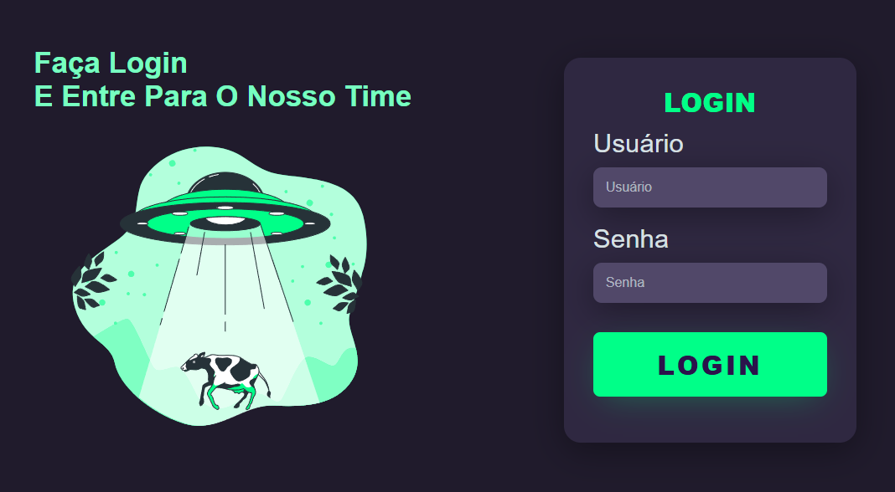

<!-- Projeto Finalizado -->
# 🔒 Login Page
<p align="center">
  <!-- Contador de linguagens do GitHub -->
  
  <!-- Tamanho do repositório no GitHub -->
  
  <!-- Licença do GitHub -->
  
</p>

<div align="center">
  
</div>

## 📝 Descrição do Projeto
Página de login responsiva com layout dividido em duas seções: uma com uma imagem de animação e outra com o formulário de login. Utiliza HTML e CSS para a estrutura e estilos.

## 🛠️ Tecnologias Empregadas
- **HTML**: Estrutura da página.
- **CSS**: Estilos e responsividade da página.

## 🔍 Visualize o Projeto
Confira o projeto online através deste [link](https://devandreotti.github.io/responsive-login/).

## 🚀 Como Executar
1. Clone o repositório:
   ```bash
   git clone https://github.com/devAndreotti/responsive-login.git
   ```
2. Abra o arquivo `index.html` no navegador.

## 💪 Contribuição
Contribuições são bem-vindas! Para contribuir, siga estas etapas:
1. Faça um fork do projeto.
2. Crie uma nova branch para sua feature `git checkout -b feature/nome-feature`.
3. Commit suas mudanças `git commit -m 'Adiciona nova feature'`.
4. Envie para a branch `git push origin feature/nome-feature`.
5. Abra um Pull Request.

## 📌 Nota
Este projeto é para fins educacionais e demonstra uma página de login estilizada e responsiva. Sinta-se à vontade para explorar e adaptar conforme necessário.

<br>

---
<p align="center"> Desenvolvido por <a href="https://github.com/devAndreotti">Ricardo Andreotti Gonçalves</a> </p>
